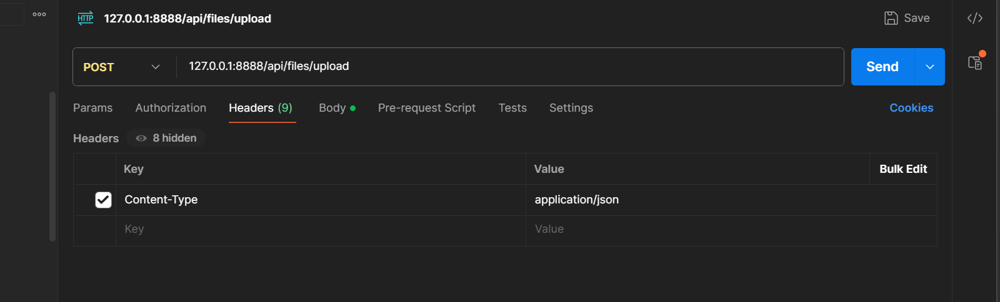
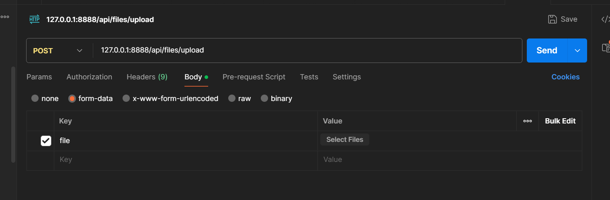

# 项目概览

1. ip localhost:8888
2. 在Mysql文件夹下 可以快速导入数据
3. 首先需要运行python项目 有python的requirements 建议conda create 一个python==3.10.13 然后 直接从requirements.txt中安装（如果报错 可以删除所有torch的依赖，因为最后不采用pytorch）
4. 项目有CUDA需求
5. 数据的流转，以注册为例，首先命中controller下的RegisterController 进行路由请求，然后进入到Service下的User，进行注册相关逻辑，注册时会进入到mapper下的userMapper 进行数据库查询，查询完毕，会将结果封装到RegisterResponse中生成数据，然后返回给前端。
6. 值得注意的是数据库中使用的是region，而springboot和flask使用的是chunk，这是一个东西，前后开发时间过长导致命名不一致（）

# Springboot项目结构

```java
├─.idea
│  └─dataSources
│      └─e7f10d92-44a2-4a46-9798-45ab4d9a9fcf
│          └─storage_v2
│              └─_src_
│                  └─schema
├─.mvn
│  └─wrapper
├─log
├─src
│  ├─main
│  │  ├─java
│  │  │  └─com
│  │  │      └─example
│  │  │          └─qingyuanbackend //擎源后端代码
│  │  │              ├─Config // 配置加密，swagger，springdoc
│  │  │              ├─Controller  // controller层 可以查看接口的路由
│  │  │              ├─mapper // 操作数据库的mapper
│  │  │              ├─model // 定义ORM模型 
│  │  │              ├─responseOrRequest // 请求
│  │  │              ├─service  //Service 层 写用户逻辑
│  │  │              └─utils  // 小工具
│  │  └─resources
│  │      └─templates // 前端模板 用来测试用
│  └─test  // 测试代码 以后慢慢写
│      └─java
│          └─com
│              └─example
│                  └─qingyuanbackend
│                      └─Controller

```

# 访问接口文件 测试

http://localhost:8888/swagger-ui/index.html

进入之后可以测试这些接口

# 有关文件上传

这个文件上传只是实现了文件上传和故障处理，还没有具体落实到后端 但是可以看到数据库abnormalities表中的结构。在testDataset中维护了相关可以用来上传的数据 这个在swagger中无法测试 可以参考利用postman等请求工具 





