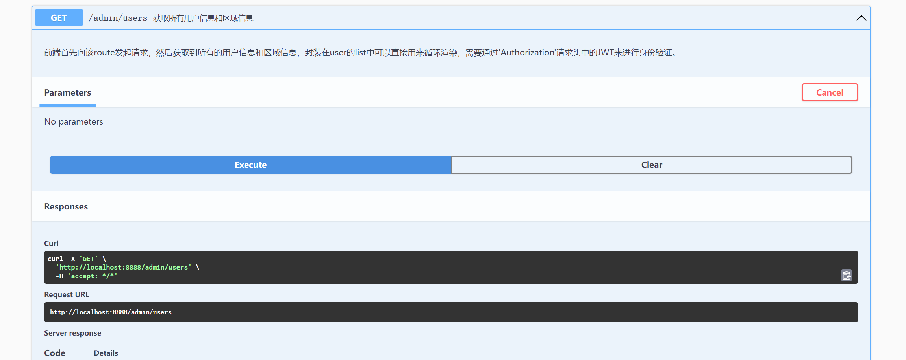
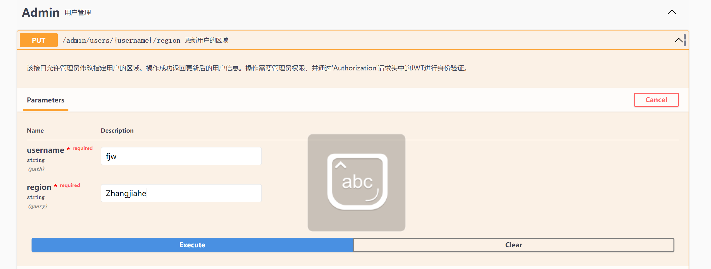

# admin管理用户接口测试结果

## 查询区域和用户

**注意**：**由于项目默认只有一个管理员，故编写SQL 查询语句时自动不查询身份为admin的用户**



```json
{
  "regions": [
    "chunk",
    "Default",
    "Shanghai",
    "Suzhou",
    "test",
    "Zhangjiahe",
    "Zjhdsb"
  ],
  "success": true,
  "users": [
    {
      "id": 1,
      "username": "test1",
      "phone": "13009730974",
      "password": "$2a$10$VCV9hZkin81XI/WZsbO5vuVd34XkR3kE.Z0nWN..3qfKgTczO8oHS",
      "role": "检测员",
      "avatar": "string",
      "region": "chunk"
    },
    {
      "id": 2,
      "username": "fjw",
      "phone": "13009730974",
      "password": "$2a$10$8SoDKazwZgh9yNztekxgxudqTvfHhwI8e6cAbH/TzhlE9cU6oso7q",
      "role": "检测员",
      "avatar": "string",
      "region": "Default"
    }
  ]
}
```

## 修改用户

将fjw 的区域修改为Zhangjiahe



```json
{
  "success": true,
  "user": {
    "id": 2,
    "username": "fjw",
    "phone": "13009730974",
    "password": "$2a$10$8SoDKazwZgh9yNztekxgxudqTvfHhwI8e6cAbH/TzhlE9cU6oso7q",
    "role": "检测员",
    "avatar": "string",
    "region": "Zhangjiahe"
  }
}
```

## 删除


```json
{
  "success": true,
  "user": {
    "id": 1,
    "username": "test1",
    "phone": "13009730974",
    "password": "$2a$10$VCV9hZkin81XI/WZsbO5vuVd34XkR3kE.Z0nWN..3qfKgTczO8oHS",
    "role": "检测员",
    "avatar": "string",
    "region": "chunk"
  }
}
```


重新查询所有用户和区域信息可知

```json
{
  "regions": [
    "chunk",
    "Default",
    "Shanghai",
    "Suzhou",
    "test",
    "Zhangjiahe",
    "Zjhdsb"
  ],
  "success": true,
  "users": [
    {
      "id": 2,
      "username": "fjw",
      "phone": "13009730974",
      "password": "$2a$10$8SoDKazwZgh9yNztekxgxudqTvfHhwI8e6cAbH/TzhlE9cU6oso7q",
      "role": "检测员",
      "avatar": "string",
      "region": "Zhangjiahe"
    }
  ]
}
```