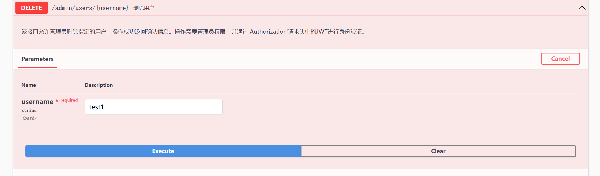

# admin管理用户接口测试结果

## 查询区域和用户

**注意**：**由于项目默认只有一个管理员，故编写SQL 查询语句时自动不查询身份为admin的用户**


```json
{
  "regions": [
    "chunk",
    "Default",
    "Shanghai",
    "Suzhou",
    "test",
    "Zhangjiahe",
    "Zjhdsb"
  ],
  "success": true,
  "users": [
    {
      "id": 1,
      "username": "test1",
      "phone": "13009730974",
      "password": "$2a$10$VCV9hZkin81XI/WZsbO5vuVd34XkR3kE.Z0nWN..3qfKgTczO8oHS",
      "role": "检测员",
      "avatar": "string",
      "region": "chunk"
    },
    {
      "id": 2,
      "username": "fjw",
      "phone": "13009730974",
      "password": "$2a$10$8SoDKazwZgh9yNztekxgxudqTvfHhwI8e6cAbH/TzhlE9cU6oso7q",
      "role": "检测员",
      "avatar": "string",
      "region": "Default"
    }
  ]
}
```

## 修改用户

将fjw 的区域修改为Zhangjiahe


```json
{
  "success": true,
  "user": {
    "id": 2,
    "username": "fjw",
    "phone": "13009730974",
    "password": "$2a$10$8SoDKazwZgh9yNztekxgxudqTvfHhwI8e6cAbH/TzhlE9cU6oso7q",
    "role": "检测员",
    "avatar": "string",
    "region": "Zhangjiahe"
  }
}
```

## 删除



```json
{
  "success": true,
  "user": {
    "id": 1,
    "username": "test1",
    "phone": "13009730974",
    "password": "$2a$10$VCV9hZkin81XI/WZsbO5vuVd34XkR3kE.Z0nWN..3qfKgTczO8oHS",
    "role": "检测员",
    "avatar": "string",
    "region": "chunk"
  }
}
```


重新查询所有用户和区域信息可知

```json
{
  "regions": [
    "chunk",
    "Default",
    "Shanghai",
    "Suzhou",
    "test",
    "Zhangjiahe",
    "Zjhdsb"
  ],
  "success": true,
  "users": [
    {
      "id": 2,
      "username": "fjw",
      "phone": "13009730974",
      "password": "$2a$10$8SoDKazwZgh9yNztekxgxudqTvfHhwI8e6cAbH/TzhlE9cU6oso7q",
      "role": "检测员",
      "avatar": "string",
      "region": "Zhangjiahe"
    }
  ]
}
```

## 故障数据测试结果


通过region和layer（层数）进行查询

结果

```json
{
  "tableId": [
    [
      "(10,1)",
      "(11,1)",
      "(12,1)",
      "(13,1)",
      "(14,1)",
      "(15,1)",
      "(16,1)",
      "(17,1)"
    ],
    [
      "(10,2)",
      "-1",
      "-1",
      "-1",
      "-1",
      "-1",
      "-1",
      "(17,2)"
    ],
    [
      "(10,3)",
      "-1",
      "-1",
      "-1",
      "-1",
      "-1",
      "-1",
      "(17,3)"
    ],
    [
      "(10,4)",
      "-1",
      "-1",
      "-1",
      "-1",
      "-1",
      "-1",
      "(17,4)"
    ],
    [
      "(10,5)",
      "(11,5)",
      "(12,5)",
      "(13,5)",
      "(14,5)",
      "(15,5)",
      "(16,5)",
      "(17,5)"
    ]
  ],
  "tableStatus": [
    [
      0,
      0,
      0,
      0,
      0,
      0,
      0,
      0
    ],
    [
      0,
      -1,
      -1,
      -1,
      -1,
      -1,
      -1,
      2
    ],
    [
      2,
      -1,
      -1,
      -1,
      -1,
      -1,
      -1,
      0
    ],
    [
      0,
      -1,
      -1,
      -1,
      -1,
      -1,
      -1,
      0
    ],
    [
      0,
      0,
      2,
      0,
      0,
      2,
      0,
      0
    ]
  ],
  "maxX": 17,
  "maxY": 5,
  "regionName": "Shanghai",
  "layer": 1
}
```

正好对应了前端的两个二维数组（一个是标签，一个是真正的状态值）

值得注意的是，状态值有多重

```markdown
# 发生的故障标签
# 0 正常
# 1 左右轨道高度不一
# 2 轨道出现较大落差
# 3 轨道不平顺
# 4 穿梭车因为打滑 出现骑轨（这个暂时废弃）
```

**所以需要调整前端的配色**

通过点击那个方块（是用按钮实现的），原来是请求行和列 现在需要增加region和层数还有label以便于后端定位


```json
{
  "id": 3,
  "regionName": null,
  "x": 10,
  "y": 3,
  "label": 2,
  "time": "2023-11-08T05:04:00.000+00:00",
  "status": 1,
  "layers": 1,
  "labelDescription": "轨道接缝出现较大落差，小车发生颠簸",
  "fixStatus": "轨道出现异常，请即使上报维护申请。",
  "fixSuggestionde": "检查轨道接缝处，需要平整处理。"
}
```

